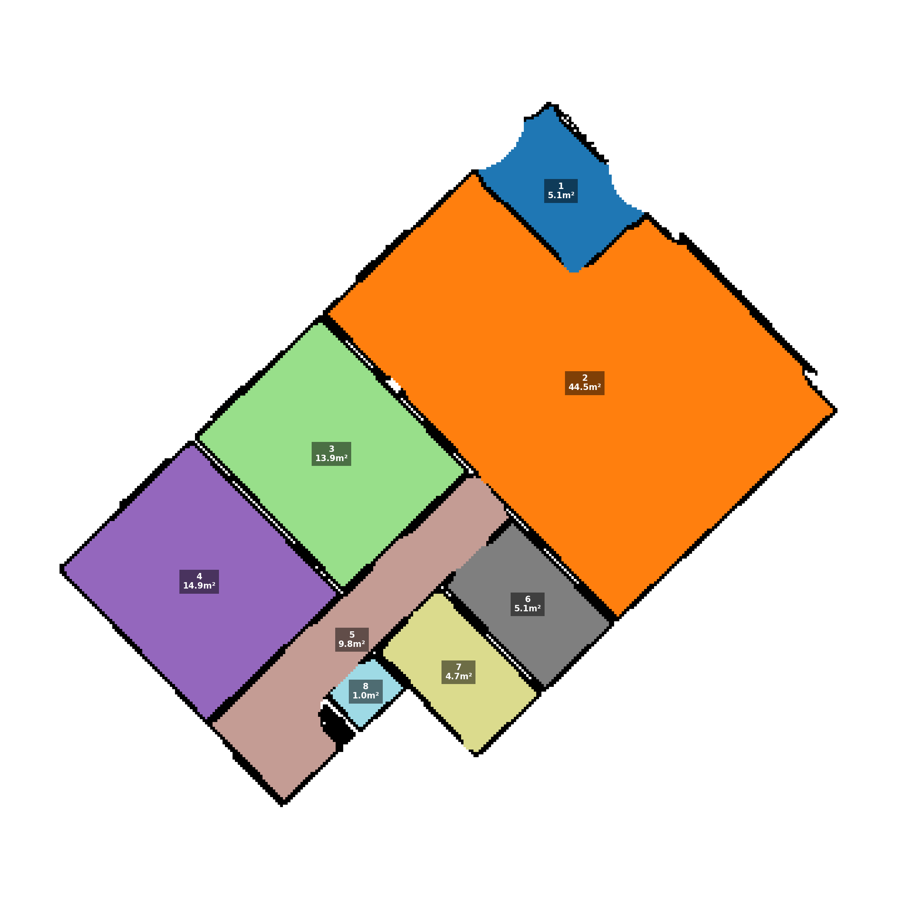

#### Room segmentation (Progress Update)
* Trying to approach the ceiling instead of the floor, the team tries to slice the room at the very top, so that the furniture is cut off using Wafer Slice technique 

The output the current Region Growing (using "appartement_SOR_NoiseFiltered_5mm.las")
#### Calculated Area of the entire apartment: 98,2 m²

## Pre-processing testing step with 5mm las file (First checkpoint of the building pipeline)
#### Quality check if the vector normalization was done correctly
#### Results: it displays Vector Normalization with walls are labeled as vertical and floors are labeled as horizontal

## Clustering / Segmentation
#### Test if the parameter tuning is working
#### Results: it proves that all wall's colors are modifying every time the parameter value (e.g., normal_feature_weight) is changed, shows that the parameter tuning is functional

### Parameter Tuning Guide for Pre-processing step.
| Parameter | Function | Increase if | Decrease if |
| :--- | :--- | :--- | :--- |
| **Normal Weight** | **Separates Angles:** Controls how strictly the algorithm separates surfaces based on their facing direction. | Floor and walls are merging into the same color/cluster. | Curved objects (like pillars or domes) are "shattering" into many small vertical strips. |
| **Epsilon** | **Search Radius:** The maximum distance (in spatial + weighted feature space) to search for neighbors. | Valid single objects are breaking into multiple disconnected pieces. | Distinct nearby objects (e.g., a chair touching a table) are merging into one blob. |
| **Min Points** | **Noise Filter:** The minimum density required to form a valid cluster. | when seeing too much "dust," floating ghost points, or sparse noise. | means losing thin details like table legs, pipes, or window frames (they turn black/noise). |
