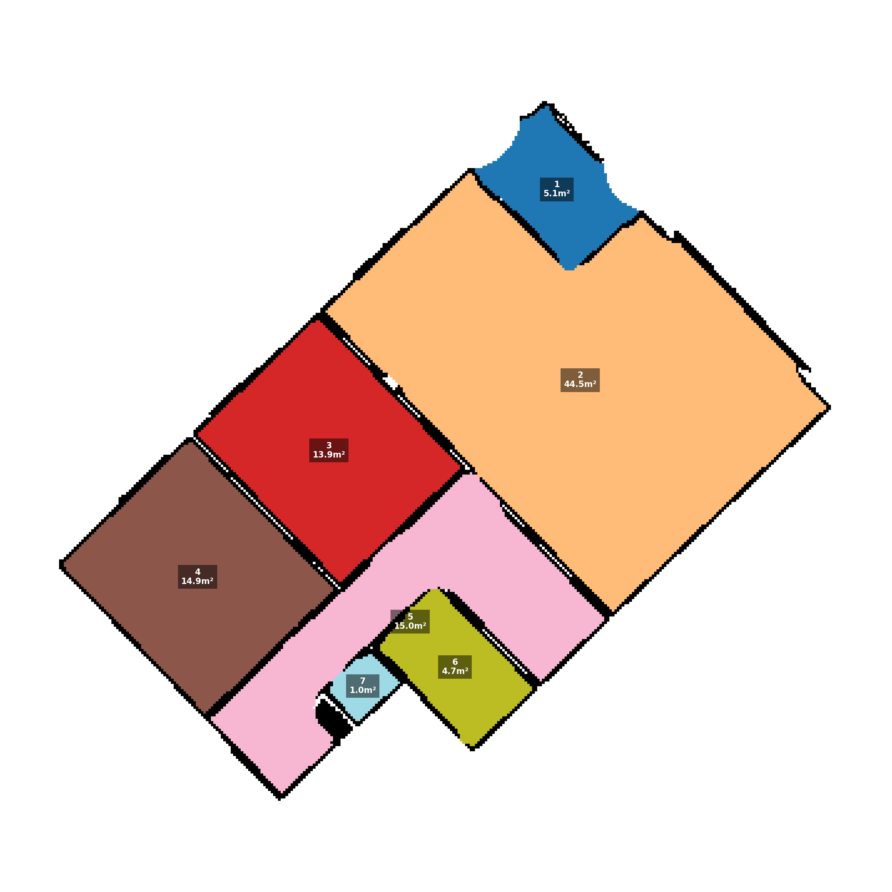
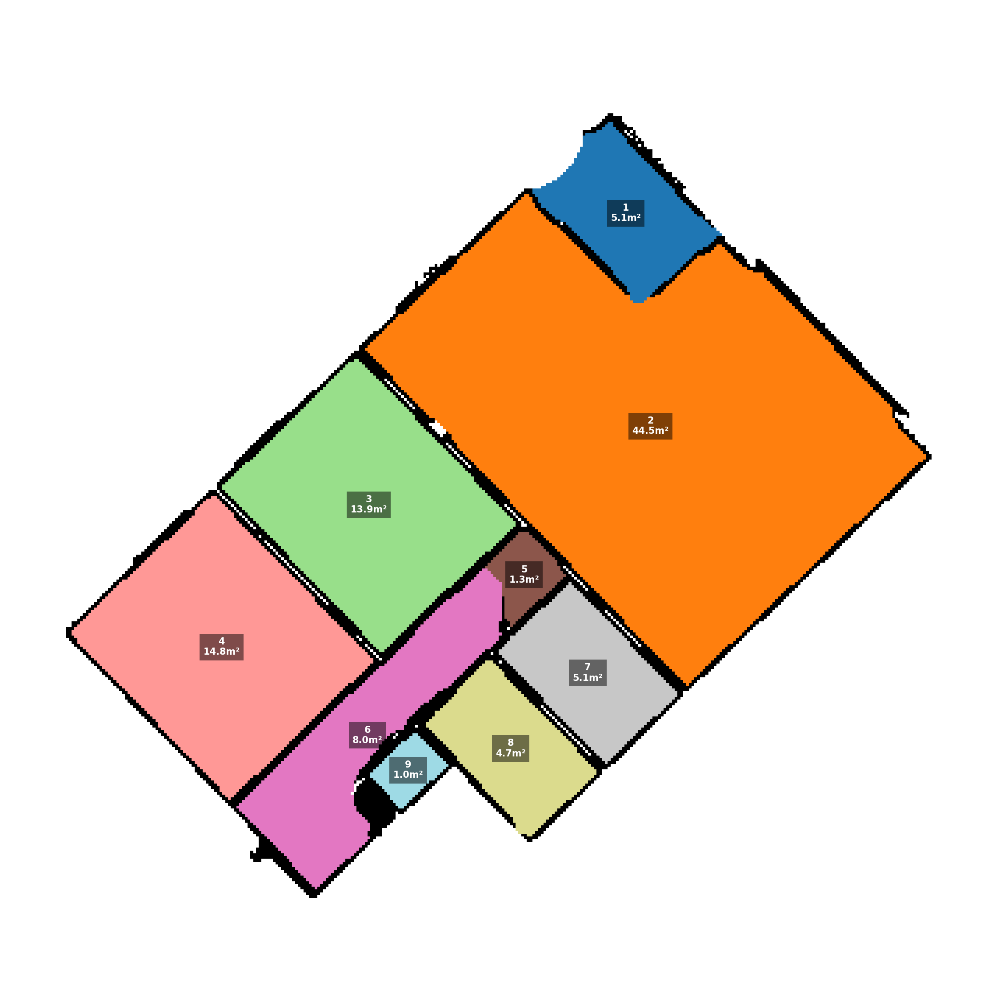
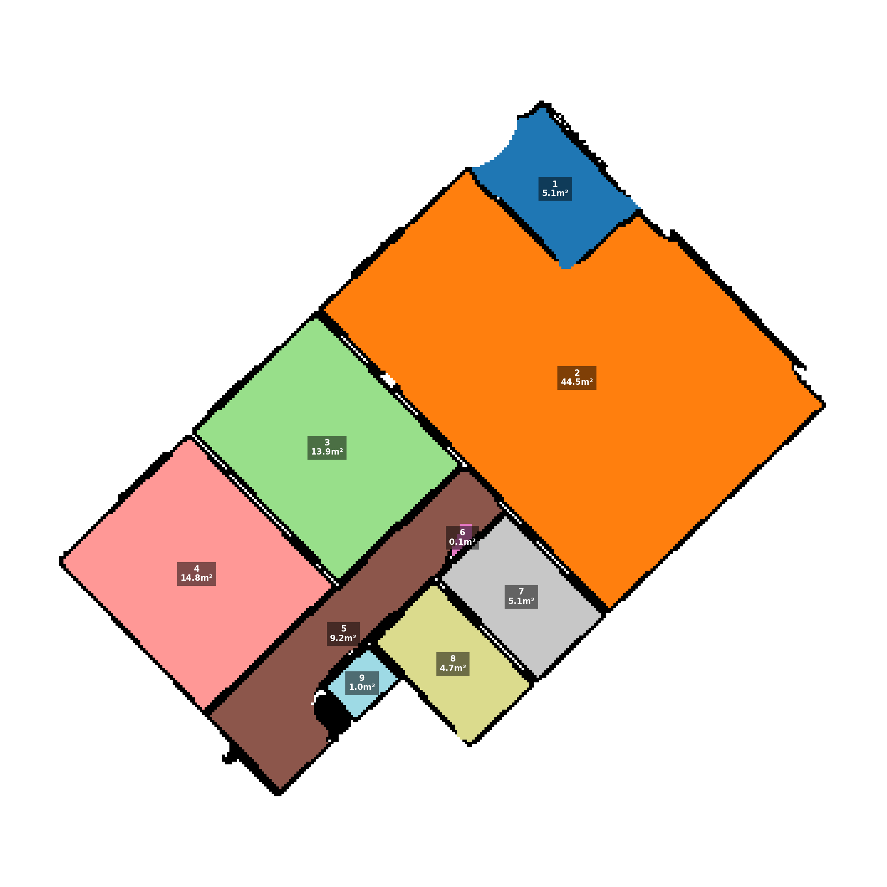
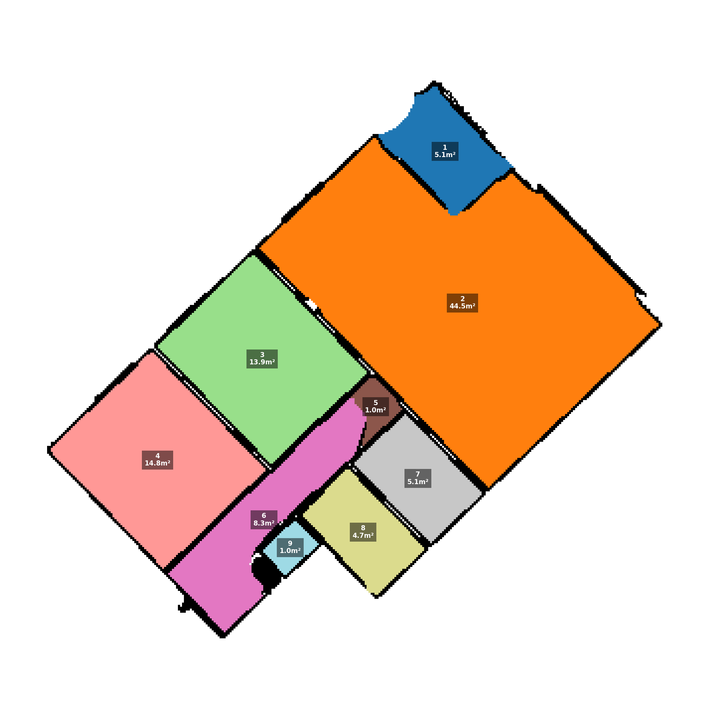
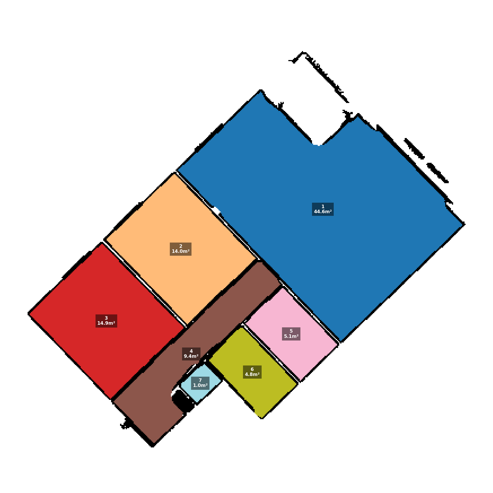
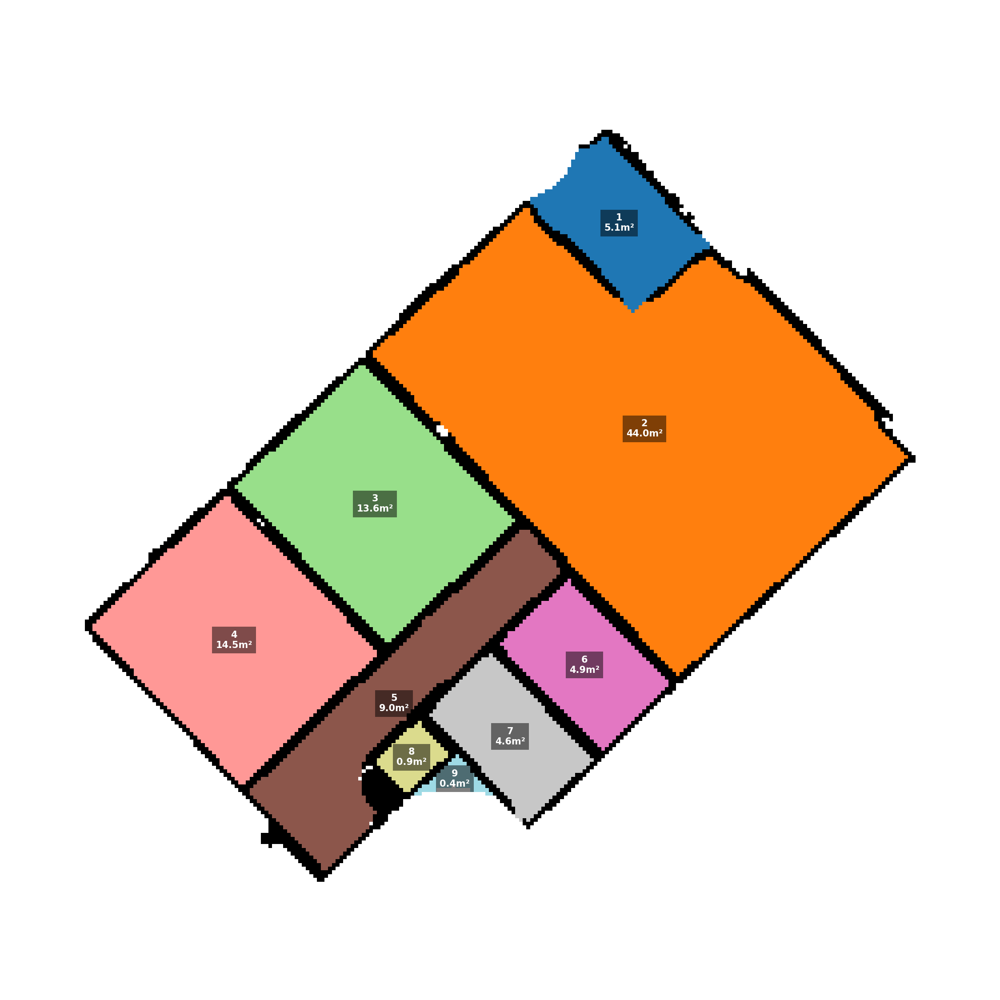

## Algorithm Parameter Report: Room Segmentation Logic (for SOR las/laz file)

### 1. Executive Summary
 - The room segmentation algorithm uses **Reflected Ceiling Plan** approach. Instead of analyzing the floor (which is cluttered with furniture), the team analyzes the top of the apartment.
 - The method relies on 4 key parameters. This document explains what they are, why the matter, and how the team tuned them to achieve the best result as possible.

---

| **Parameter**        | **Sweet Spot**    | **If set too LOW (Failure Point)**                                                                     | **If set too HIGH (Failure Point)**                                                                           |
| -------------------- | ----------------- | ------------------------------------------------------------------------------------------------------ | ------------------------------------------------------------------------------------------------------------- |
| **Slice Thickness**  | **0.17m – 0.28m** | **< 0.15m:** Walls disappear. The slice becomes too thin to see door headers, causing rooms to merge.  | **> 0.30m:** Furniture appears. The slice hits the top of kitchen cabinets/fridges, creating "phantom rooms." |
| **Ceiling Offset**   | **0.05m – 0.06m** | **< 0.04m:** Ceiling noise. Surface-mounted lights or textured plaster are hit, creating random dots.   | **> 0.10m:** Missed headers. Start slicing *below* the top of the door frame, losing the wall entirely.    |
| **Erosion Radius**   | **0.30m – 0.35m** | **< 0.20m:** Leaking. The erosion isn’t strong enough to break the 0.8m connection of a standard door. | **> 0.50m:** Fragmentation. Thin walls or split narrow hallways are scrubbed away into multiple broken pieces.    |
| **Voxel Resolution** | **0.05m**         | **< 0.02m:** Noise overload. Walls look like “dust” instead of solid lines, confusing the algorithm.   | **> 0.10m:** It causes errors. The pixels are too big to represent thin walls, causing leaks.                    |

---

### 3. The Slicing Parameters In Details (Finding the Walls)
These settings determine what the computer sees.
#### A. Slice Thickness (The Wafer Slice Technique)
Definition: How deep of a slice the user takes from the ceiling downwards.
- The Sweet Spot: **0.21m - 0.25m** (depending on wall header depth).
- It matters because:
### Slice Thickness Effects

| **If too Thin (<= 0.20m)** | **If too Thick (>= 0.26m)** |
|---------------------------|-----------------------------|
|  |  |
| The slice is too low and misses door headers. The system merges rooms incorrectly. | The slice is too high and hits tall furniture / external walls, creating phantom rooms. |

* The tuning: The team uses Adaptive Slicing computational task that combines a thin layer (to save low-ceiling rooms) with a deep layer (to catch walls).

#### B. Ceiling Offset
Definition: The safety buffer the user skips at the very top before we start slicing.
- The Sweet Spot: **0.05m - 0.06m (5-6 cm)**.
- It matters because:
* Ceilings are never perfectly flat. They have texture, paint, and surface-mounted lights.
* The team skims the top 6cm to make sure clean air and walls are cut through, not light fixture or smoke detectors.

### 4. The Processing Parameter (Defining the Rooms)
These settings determine how the computer thinks.
#### C. Erosion Radius (The "Doorway Separator")
Definition: The algorithm temporarily shrinks the open space of a room to break the connection between areas.
- The Sweet Spot: **0.25m - 0.33m**.
- It matters because: The doorway is usually 0.80m wide. If we shrink the room by 0.35m from both sides (0.70m total), the 'water' connecting the rooms recedes, and the connection breaks.

| **If too Weak (< 0.24m)** | **If too Strong (> 0.34m)** |
|---------------------------|-----------------------------|
|  |  |
| The connection remains. However, the erosion does not thicken enough that does not cover the door entirely, resulting creating a 'phantom' room since the computer thinks it hits the wall. | The user accidentally scrubs away thin walls or split a narrow hallway into fragmented pieces, also resulting in 'phantom' rooms. |

#### D. Voxel Resolution (The "Pixel Size")
Definition: The level of detail for the digital map.
- The Sweet Spot: **0.05m (5cm)**.
- It matters because: Real interior walls are 10-15cm thick, so 5cm is the ideal block size to represent a wall.

| **If too small (<=4cm)**  | **If too large (>=7cm)** |
|---------------------------|-----------------------------|
|  |  |
| The map becomes too noisy, a single missing laser point looks like a hole in the wall, resulting in losing the balcony. | The pixels are too clunky, narrow walls disappear entirely, creating phantom rooms OUTSIDE the apartment. |

### 5. Conclusion
By calibrating these four parameters, the algorithm will successfully:
- Ignores Furniture: By slicing high (Ceiling logic)
- Detects All Walls: By using Adaptive Slicing (smart merge)
- Separates Rooms: By tuning the Erosion to the width of a standard door.