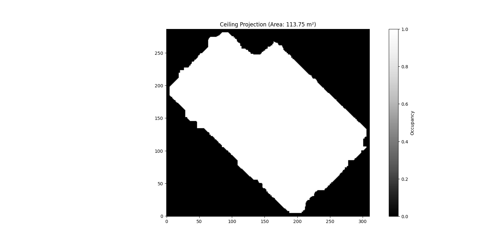

The output the current Region Growing (using "appartement_SOR_NoiseFiltered_5mm.las")
#### Calculated Area of the entire apartment: 98,2 m²

The output of the new "Ceiling Projection Strategy".

#### Calculated Area of the entire apartment:** 113.75 m²

